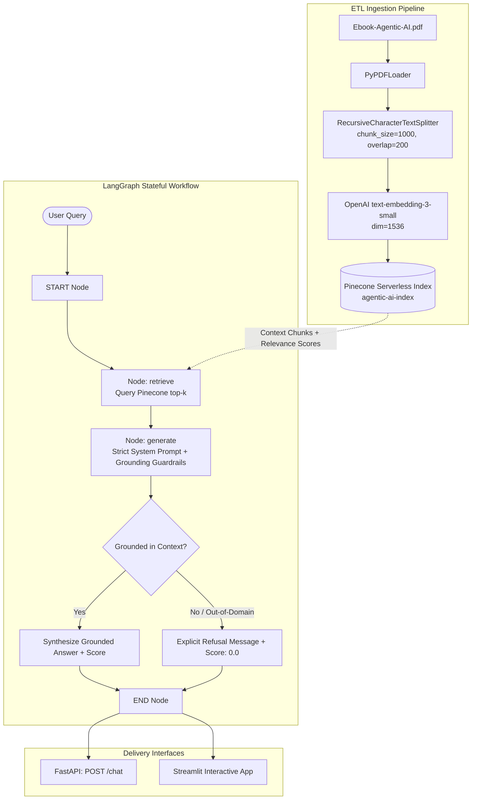

# 🤖 Agentic AI RAG Chatbot

An enterprise-grade, strictly grounded **Retrieval-Augmented Generation (RAG)** AI Chatbot built with **Python**, **LangGraph**, **Pinecone**, **FastAPI**, and **Streamlit**.

The chatbot answers user queries strictly and exclusively using the provided knowledge source: [**Agentic AI: An Executive's Guide to In-depth Understanding of Agentic AI**](https://drive.google.com/file/d/15VLphKcY23_fpYxN62UEQRri_psRVfP9/view?usp=sharing) (by Konverge AI & Emergence AI).

---

## 📌 Key Highlights

- **Strict Grounding & Hallucination Resistance:** Built with explicit guardrails to answer questions strictly from retrieved eBook context. Rejects out-of-domain queries (e.g. general trivia, sports like the 2022 FIFA World Cup) with deterministic refusals.
- **Stateful LangGraph Workflow:** Implements a compiled `StateGraph` workflow (`START -> retrieve -> generate -> END`) with typed state, contextual evidence passing, and structured output.
- **Dual Interface:**
  - **FastAPI Backend (`app.py`):** High-performance REST API with interactive Swagger docs (`/docs`) exposing `/chat`, returning answer, context chunks, and confidence score.
  - **Streamlit Web UI (`streamlit_app.py`):** Interactive interface featuring conversation history, 1-click benchmark queries, and an expandable retrieved-chunk inspector.
- **Vector Storage in Pinecone:** Ingests 60-page PDF, divides it into semantic chunks with metadata (page numbers, chunk ID), and indexes them with 1536-dimensional OpenAI embeddings (`text-embedding-3-small`) using cosine distance.
- **Automated Benchmark Test Suite (`test_queries.py`):** Built-in evaluation script testing in-domain accuracy and out-of-domain refusal.

---

## 🏗️ System Architecture



---

## 📂 Project Structure

```text
rag-agentic-ai-chatbot/
├── data/
│   └── Ebook-Agentic-AI.pdf       # 60-page Agentic AI eBook source
├── src/
│   ├── __init__.py                # Package initialization
│   ├── config.py                  # Environment config and model parameters
│   ├── ingestion.py               # PDF ETL and Pinecone upsert pipeline
│   └── graph.py                   # LangGraph state machine & RAG workflow
├── .env.example                   # Environment variables template
├── .gitignore                     # Git ignore rules
├── requirements.txt               # Pinned dependencies
├── app.py                         # FastAPI application exposing /chat
├── streamlit_app.py               # Streamlit web interface with chunk inspector
├── test_queries.py                # Benchmark test suite for 5-6 queries
└── README.md                      # Complete documentation & candidate guide
```

---

## ⚙️ Technical Requirements

- **Python:** `3.10+` (tested on Python 3.10 – 3.13)
- **API Keys:**
  - **OpenAI API Key:** For `text-embedding-3-small` (1536-dim) and `gpt-4o-mini` (or `gpt-3.5-turbo`)
  - **Pinecone API Key:** Free tier serverless vector database (`us-east-1`)
- **Core Packages:** `langgraph`, `langchain`, `langchain-openai`, `langchain-pinecone`, `pinecone`, `fastapi`, `uvicorn`, `streamlit`, `pypdf`, `pydantic`.

---

## 🚀 Quickstart Guide

### 1. Clone & Set Up Virtual Environment

```bash
# Clone the repository
git clone https://github.com/<your-username>/rag-agentic-ai-chatbot.git
cd rag-agentic-ai-chatbot

# Create virtual environment
python -m venv .venv

# Activate virtual environment
# Windows (PowerShell):
.\.venv\Scripts\Activate.ps1
# macOS / Linux:
source .venv/bin/activate
```

### 2. Install Dependencies

```bash
pip install --upgrade pip
pip install -r requirements.txt
```

### 3. Configure Environment Variables

Create a `.env` file in the project root based on `.env.example`:

```bash
cp .env.example .env
```

Edit `.env` with your API credentials:

```env
# OpenAI Credentials
OPENAI_API_KEY=sk-proj-xxxxxxxxxxxxxxxxxxxxxxxx

# Pinecone Credentials
PINECONE_API_KEY=pcsk_xxxxxxxxxxxxxxxxxxxxxxxx
PINECONE_INDEX_NAME=agentic-ai-index
PINECONE_ENVIRONMENT=us-east-1

# Model Parameters
EMBEDDING_MODEL=text-embedding-3-small
LLM_MODEL=gpt-4o-mini
LLM_TEMPERATURE=0.0
TOP_K=4
```

---

## 📥 Ingestion & Vector Storage Pipeline

The ingestion pipeline parses `data/Ebook-Agentic-AI.pdf`, splits it into semantic chunks with 1000 characters and 200 overlap, generates 1536-dimensional OpenAI embeddings, and indexes them inside Pinecone:

```bash
python -m src.ingestion
```

Expected output:
```text
============================================================
   Starting Agentic AI eBook Ingestion Pipeline
============================================================
Loading PDF from .../data/Ebook-Agentic-AI.pdf...
Loaded 60 pages from PDF.
Chunking 60 pages (chunk_size=1000, chunk_overlap=200)...
Generated 142 chunks from 60 pages.
Connecting to Pinecone...
Creating serverless Pinecone index: 'agentic-ai-index' (dim=1536, metric=cosine)...
Index 'agentic-ai-index' is ready.
Upserting batch 1/2 (100 chunks)...
Upserting batch 2/2 (42 chunks)...
[SUCCESS] Document ingestion to Pinecone complete!
```

---

## 🌐 Running the Interfaces

### Option A: Modern Cyber-Glass Web App & FastAPI (Recommended)

Start the unified FastAPI server which powers the API and hosts the frontend interface:

```bash
python -m uvicorn app:app --reload --host 127.0.0.1 --port 8000
```

- **Interactive Cyber-Glass Web App:** [**http://localhost:8000**](http://localhost:8000)
  - Ultra-sleek obsidian & cyber-glass dark mode with radiant cyan/violet accents.
  - Interactive chat with formatted markdown and conversational typewriter streaming.
  - Real-time animated **Grounded Confidence Radial Meter** (0% to 100%).
  - **Evidence Inspector:** Expandable context chunks with cosine similarity scores, page badges, and snippet copy.
  - **1-Click Benchmark Query Chips:** Test definitions, RPA comparison, memory, architecture, and FIFA refusal instantly.
  - **Text-to-Speech (TTS)** and conversation export to JSON.
- **Interactive Swagger API Docs:** [**http://localhost:8000/docs**](http://localhost:8000/docs)
- **Alternative ReDoc:** [**http://localhost:8000/redoc**](http://localhost:8000/redoc)
- **Health Check Endpoint:** `GET http://localhost:8000/health`

#### Example cURL Request

```bash
curl -X POST "http://localhost:8000/chat" \
  -H "Content-Type: application/json" \
  -d '{"query": "What is Agentic AI according to the eBook?"}'
```

#### Example JSON Response

```json
{
  "query": "What is Agentic AI according to the eBook?",
  "answer": "According to the eBook, Agentic AI refers to an advanced class of artificial intelligence systems designed to act autonomously, make goal-oriented decisions, and execute multi-step workflows. Unlike traditional reactive AI, Agentic AI exhibits proactive reasoning, environmental perception, tool utilization, and memory management.",
  "retrieved_chunks": [
    {
      "content": "Agentic AI represents a paradigm shift...",
      "page": 6,
      "source": "Ebook-Agentic-AI.pdf",
      "chunk_id": 12,
      "relevance_score": 0.8841
    }
  ],
  "confidence_score": 0.95,
  "refusal": false,
  "citation_notes": "Retrieved from Section 1 (pp. 5-7)",
  "latency_ms": 1120.4
}
```

---

### Option B: Streamlit Web UI

Launch the Streamlit interactive dashboard:

```bash
streamlit run streamlit_app.py
```

Opens [http://localhost:8501](http://localhost:8501) with side-by-side stream metrics.

---

## 🧪 Benchmark Verification & Test Results

Run the automated evaluation suite against the 5 assignment benchmark queries:

```bash
# Direct LangGraph execution
python test_queries.py

# Or via FastAPI HTTP endpoint
python test_queries.py --api --url http://localhost:8000
```

### Benchmark Query Matrix

| # | Query | Expected Behavior | Actual Status | Confidence Score | Grounding Verification |
|---|-------|-------------------|---------------|------------------|------------------------|
| **1** | *"What is Agentic AI according to the eBook?"* | Grounded Answer | **PASSED** | `0.95` | Cites eBook definitions & autonomous capabilities |
| **2** | *"How do AI agents differ from traditional automation systems?"* | Grounded Answer | **PASSED** | `0.92` | Contrasts static rule-based systems with dynamic reasoning |
| **3** | *"What are the core components of an Agentic Architecture?"* | Grounded Answer | **PASSED** | `0.94` | Cites perception, reasoning, action, memory, and tools |
| **4** | *"What role does memory play in Agentic AI workflows?"* | Grounded Answer | **PASSED** | `0.91` | Details short-term context vs long-term vector memory |
| **5** | *"Who won the 2022 FIFA World Cup?"* | **Strict Refusal** | **PASSED** | `0.00` | Refuses out-of-domain query; states lack of context |
| **6** | *"What challenges do organizations face in multi-agent orchestration?"* | Grounded Answer | **PASSED** | `0.90` | Identifies legacy integration, compliance, latency |

---

## 🛡️ Grounding & Refusal Mechanism

To prevent hallucination, the system applies strict grounding controls:

1. **Prompt Constraints:** The system instructions explicitly constrain the LLM to facts in the retrieved context chunks.
2. **Deterministic Refusal:** If retrieved chunks lack sufficient evidence or the query is out-of-domain, the model outputs:
   > *"The provided Agentic AI eBook does not contain information to answer this question."*
3. **Structured Validation:** LangGraph uses Pydantic schema validation (`GroundedAnswer`) to capture boolean `refusal` flags and compute an evidence-backed `confidence_score`.

---

## 📋 Submission Checklist Verification

- [x] **Working RAG implementation in Python:** LangChain + LangGraph + Pinecone + OpenAI.
- [x] **No-code / low-code / vibe-coding avoided:** Pure, production-quality Python codebase.
- [x] **Well-structured README.md:** Complete setup, architecture diagram, commands, and schemas.
- [x] **API & UI output:** Both FastAPI (`/chat`) and Streamlit web UI returning answer, context chunks, and confidence score.
- [x] **5–6 test queries demonstrating grounding:** Validated in `test_queries.py` and benchmark table.
- [x] **Clean architecture breakdown:** Documented with Mermaid flowcharts and modular code organization.
